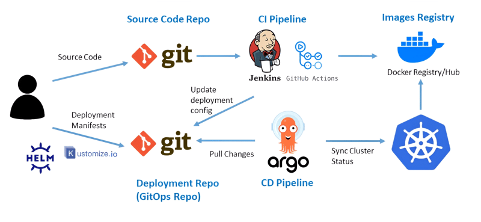
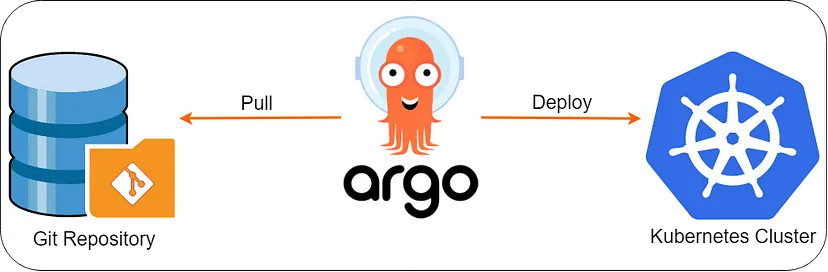
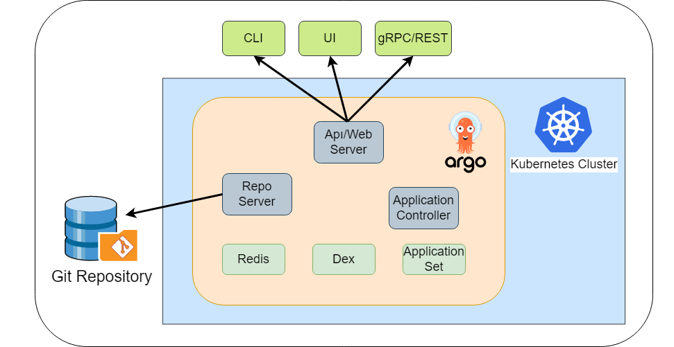

## what is gitops?
* gitops is git single source of truth to deliver application and infrastructure
*  This approach ensures tracking, versioning, and automating deployments in a systematic way. 

## gitops workflow image

## Principles of GitOps:

1) **Declarative**: Systems managed by GitOps must have their desired state defined in a declarative format.

2) **Versioned and Immutable**: All configurations must be stored in a version-controlled system (e.g., Git or even S3 buckets).

3) **Automatically Applied**: Changes are automatically applied using GitOps controllers.

4) **Continuously Reconciled**: The system actively checks and ensures the live state matches the desired state.

## Why GitOps?

### Before GitOps:

Deployment changes were often manual, untracked, and prone to errors.

Infrastructure updates (e.g., changing Kubernetes node configurations) lacked proper version control and auditing.

Debugging issues became difficult due to the lack of visibility into historical changes.

### With GitOps:

Every change is tracked, reviewed, and approved through pull requests.

Git acts as a single source of truth, ensuring consistency and security.

Automations handle deployments, reducing manual effort and risks.

## How GitOps Works:

**Defining the State**: Declarative configurations for applications or infrastructure are stored in a Git repository.

**Change Submission**: Developers or DevOps engineers submit a pull request to update configurations.

**Approval Process**: Changes are reviewed and approved by another team member before being merged.

**Automatic Deployment**: GitOps tools (e.g., Argo CD or Flux) detect the changes, pull the updated configurations, and apply them to the Kubernetes cluster.

**Continuous Reconciliation**: GitOps ensures the cluster’s state matches the repository and corrects any unauthorized changes.

## Key Concepts of GitOps:

Declarative Configurations: All desired states for applications or infrastructure are defined in declarative YAML manifests.

Version Control: Changes are tracked in Git, ensuring proper auditing and version history.

Automation: Tools like Argo CD or Flux automatically reconcile the desired state defined in Git with the actual state in your Kubernetes cluster.

Continuous Reconciliation: GitOps controllers ensure that any changes to the cluster are overridden if they don’t match the state in Git.

## Tools for GitOps:

### Gitops tools for kubernetes:
**Flux**: A popular GitOps tool from CNCF for Kubernetes that syncs Git repositories with clusters.
**ArgoCD**: Another CNCF tool that provides a declarative GitOps framework for Kubernetes.
**Fleet**: A lightweight GitOps solution for managing multiple Kubernetes clusters.
**Rancher Continuous Delivery**: Built on top of Fleet, ideal for managing deployments across multiple clusters.

### Infrastructure as Code (IaC) Tools
**Terraform**: Enables infrastructure provisioning and management using declarative configuration files.
**Pulumi**: Combines code-based IaC with GitOps workflows.
**AWS CloudFormation**: AWS-specific tool for infrastructure management.
**Crossplane**: Extends Kubernetes APIs to manage cloud infrastructure.

### CI/CD Tools
These tools integrate GitOps with Continuous Integration/Continuous Delivery pipelines:

**Jenkins X**: A CI/CD solution optimized for Kubernetes and GitOps.
**GitLab CI/CD**: Offers built-in GitOps capabilities.
**CircleCI**: Can be configured for GitOps workflows.
**Spinnaker**: A multi-cloud delivery platform with GitOps capabilities.

 Secrets Management --> Sealed Secrets for kubernetes,Vault by HashiCorp, AWS Secrets Manager etc
 Monitoring and Observability --> Prometheus,Grafana,Datadog,Fluentd etc
 YAML Linter: Tools like yamllint for validating and formatting YAML files.

### Policy and Security
**OPA (Open Policy Agent)**: Enforce policies across clusters.
**Kyverno**: A Kubernetes-native policy engine.
**Snyk**: Scans IaC for vulnerabilities.
**Trivy**: Kubernetes and container security scanner.

## Argo CD Architecture

Popular GitOps Tools: Argo CD (most popular with 13K+ GitHub stars),Flux CD,Jenkins X,Spinnaker (more deployment-focused, less GitOps-specific)
## Argo CD: An Introduction
## Brief History

Developed by engineers at Applatix, later acquired by Intuit.

Open-sourced and now a CNCF-graduated project.

Actively supported by companies like Intuit, Red Hat, BlackRock, and others.

## Key Features

Auto-Healing: Automatically reconciles any drift between Git and Kubernetes.

Open-Source: A part of the Argo project, including Argo Rollouts, Workflows, Events, and Notifications.

SSO Integration: Supports Single Sign-On (SSO) with external providers.

## Architecture

Argo CD consists of multiple components, each performing specific tasks to manage the synchronization between Git and Kubernetes.

Components

**Repo Server**:Connects to Git to fetch the desired application state (manifests).
**Application Controller**:Communicates with Kubernetes to get the actual cluster state.Compares the Git state with the Kubernetes state and reconciles discrepancies.
**API Server**:Provides UI and CLI interfaces for user interaction.Handles authentication and integrates with external identity providers.
**Dex**:Lightweight proxy server for SSO and OAuth authentication.
**Redis**:Used for caching state information to ensure the system can recover after downtime.

### Advantages of GitOps with Argo CD
Consistency: Ensures the Kubernetes cluster always matches the desired state in Git.
Auto-Healing: Automatically corrects manual changes in the cluster that deviate from the desired state.
Declarative Management: Git acts as the single source of truth.
Easy Rollbacks: Reverting to a previous state is as simple as rolling back changes in Git.

### Installation Methods
YAML manifests,Helm charts,Kubernetes operators

